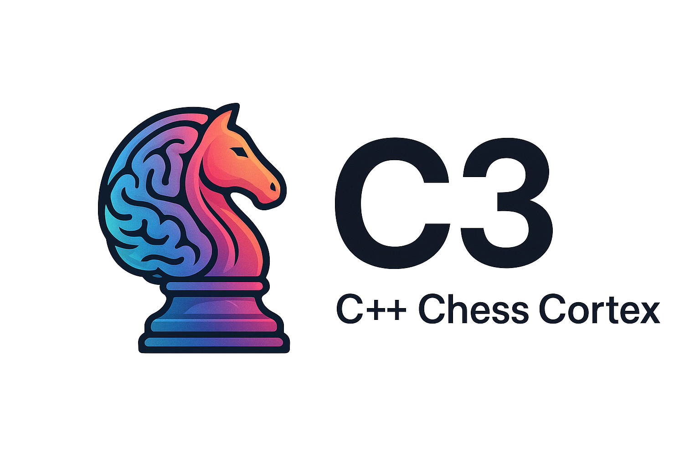

# c3



An educational chess engine that balances performance with readability, built to explore chess programming techniques using modern C++23.

## Why

This project grew out of a fascination with chess programming and a desire to deepen my C++ experience. The engine is heavily documented and draws inspiration from Tom Cant's [chess-rs](https://github.com/tomcant/chess-rs) 🙏🏻.

## Features

- Bitboards with magic bitboard move generation
- Iterative deepening with aspiration windows
- Negamax with alpha-beta pruning and principal variation search
- Null-move pruning, quiescence search, check extensions
- Transposition table with Zobrist hashing
- Move ordering: TT move, MVV-LVA, killer moves
- Material and piece-square table evaluation
- Full UCI protocol with time management
- GoogleTest suite with perft validation
- Fastchess gauntlet testing with SPRT

## Roadmap

- Futility pruning
- Late-move reductions (LMR)
- Enhanced evaluation (king safety, pawn structure, endgame patterns)
- Opening book support
- Tablebase support
- Multi-threaded search

## Usage

After building, run the engine in UCI mode:

```bash
./build-release/c3
```

Example UCI session:

```
uci
isready
position startpos moves e2e4 e7e5
go depth 10
```

## Prerequisites

- CMake 3.20+
- Ninja (for CMake presets)
- C++23 compiler (clang++ 16+ or g++ 13+)
- Python 3 (for scripts)
- clang-format and clang-tidy (for formatting/linting)
- fastchess (optional, for gauntlet testing)

## Building

The project uses CMake presets for different build configurations:

| Preset    | Purpose                        | Output             |
| --------- | ------------------------------ | ------------------ |
| `debug`   | Development with ASan/UBSan    | `build/c3`         |
| `release` | Optimized with LTO             | `build-release/c3` |
| `lint`    | Static analysis via clang-tidy | `build-tidy/`      |

### Development (Debug + sanitizers)

```bash
cmake --preset debug
cmake --build --preset debug
```

### Production (Release + LTO)

```bash
cmake --preset release
cmake --build --preset release
```

### Regenerating magic bitboards

The magic bitboard tables are checked in at `include/c3/magic.hpp`. To regenerate:

```bash
cmake --preset debug -DC3_REGENERATE_MAGIC=ON
cmake --build --preset debug
```

### Running tests

```bash
ctest --preset tests
```

## Linting & Formatting

```bash
# Format all source files
clang-format -i $(git ls-files '*.cpp' '*.hpp')

# Run clang-tidy
cmake --preset lint && cmake --build --preset lint
```

Style: 2-space indent, 100-column limit (configured in `.clang-format`).

## Gauntlet Testing

The `scripts/run_fastchess_gauntlet.py` script runs strength tests against other engines, outputting PGN files and SPRT summaries to `Testing/fastchess/`.

```bash
# Depth-limited match
python3 scripts/run_fastchess_gauntlet.py --opponent /path/to/engine --games 200 --concurrency 4 --depth 6

# Fixed movetime match
python3 scripts/run_fastchess_gauntlet.py --opponent /path/to/engine --mode movetime --movetime-ms 75

# Summarize an existing PGN
python3 scripts/run_fastchess_gauntlet.py --summarize-only tests/fixtures/fastchess_sample.pgn
```

## Resources

- [chess-rs (Tom Cant)](https://github.com/tomcant/chess-rs) - Rust chess engine inspiration
- [Chess Programming Wiki](https://www.chessprogramming.org/) - Comprehensive chess programming resource
  - [Perft Results](https://www.chessprogramming.org/Perft_Results)
  - [Test Positions](https://www.chessprogramming.org/Test-Positions)
  - [SPRT](https://www.chessprogramming.org/Sequential_Probability_Ratio_Test)
- [uci-suite](https://github.com/cosmobobak/uci-suite) - UCI testing utilities
- [autoperft](https://github.com/sohamkorade/autoperft) - Automated perft testing
- [Stockfish Opening Books](https://github.com/official-stockfish/books)
  - [8moves_v3.pgn.zip](https://github.com/official-stockfish/books/blob/master/8moves_v3.pgn.zip)
- [fastchess](https://github.com/Disservin/fastchess) - Engine testing framework

## License

MIT - see [LICENSE](./LICENSE) for details.
