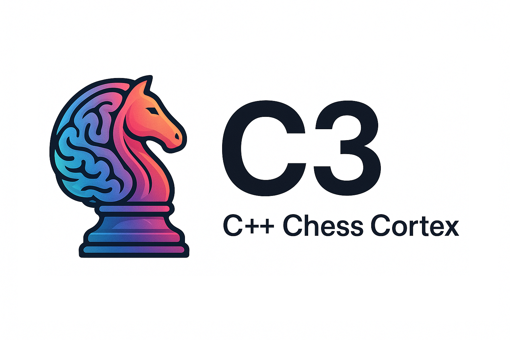

# c3



An educational chess engine that balances performance with readability, built to explore chess programming techniques using modern C++23.

## Why

This project grew out of a fascination with chess programming and a desire to deepen my C++ experience. The engine is heavily documented and draws inspiration from Tom Cant's [chess-rs](https://github.com/tomcant/chess-rs) 🙏🏻.

## Features

- Bitboards with magic bitboard move generation
- Iterative deepening with aspiration windows
- Negamax with alpha-beta pruning and principal variation search
- Null-move pruning, futility pruning, quiescence search, check extensions
- Transposition table with Zobrist hashing
- Move ordering: TT move, MVV-LVA, killer moves
- Material and piece-square table evaluation
- Full UCI protocol with time management
- GoogleTest suite with perft validation
- Fastchess gauntlet and SPRT strength testing

## Roadmap

- Late-move reductions (LMR)
- Enhanced evaluation (king safety, pawn structure, endgame patterns)
- Opening book support
- Tablebase support
- Multi-threaded search

## Usage

After building, run the engine in UCI mode:

```bash
./build-release/c3
```

Example UCI session:

```
uci
isready
position startpos moves e2e4 e7e5
go depth 10
```

## Prerequisites

- CMake 3.20+
- Ninja (for CMake presets)
- C++23 compiler (clang++ 16+ or g++ 13+)
- Python 3 (for scripts)
- clang-format and clang-tidy (for formatting/linting)
- fastchess (optional, for gauntlet testing)

## Quick Start

A Makefile wraps common commands. Run `make help` to see all targets:

```bash
make build         # Debug build with sanitizers
make release       # Release build with LTO
make profile       # -O2 build with debug info for profilers
make test          # Run unit tests (debug tree)
make test-release  # Run unit tests against the optimized build
make fmt           # Format code
make lint          # Build with clang-tidy
make clean         # Clean all build directories
```

## Building

The project uses CMake presets for different build configurations:

| Preset           | Purpose                         | Output                  | Make target         |
| ---------------- | ------------------------------- | ----------------------- | ------------------- |
| `debug`          | Development with ASan/UBSan     | `build/c3`              | `make build`        |
| `release`        | Optimized with LTO, engine only | `build-release/c3`      | `make release`      |
| `release-tests`  | Optimized build plus test suite | `build-release-tests/`  | `make test-release` |
| `relwithdebinfo` | -O2 with debug info, no LTO     | `build-relwithdebinfo/` | `make profile`      |
| `lint`           | Static analysis via clang-tidy  | `build-tidy/`           | `make lint`         |

The `release` preset builds the engine only: tests are the one thing that needs
GoogleTest, so leaving them out keeps a release build free of any download.

### Options

All options are `-D<name>=ON|OFF` at configure time:

| Option                  | Purpose                                         | Default            |
| ----------------------- | ----------------------------------------------- | ------------------ |
| `C3_BUILD_TESTS`        | Configure and build the GoogleTest suite        | `ON`               |
| `C3_WARNINGS_AS_ERRORS` | Add `-Werror` (`/WX` on MSVC); CI turns this on | `OFF`              |
| `C3_ENABLE_ASAN`        | AddressSanitizer in Debug builds                | `ON` (not Windows) |
| `C3_ENABLE_UBSAN`       | UndefinedBehaviorSanitizer in Debug builds      | `ON` (not Windows) |
| `C3_ENABLE_CLANG_TIDY`  | Run clang-tidy during the build                 | `OFF`              |
| `C3_REGENERATE_MAGIC`   | Rebuild `include/c3/magic.hpp`                  | `OFF`              |

GoogleTest is fetched at the commit tagged v1.14.0. An already installed GTest
is reused instead when CMake finds one, which requires CMake 3.24 or newer
(older versions always fetch), and
`-DFETCHCONTENT_SOURCE_DIR_GOOGLETEST=/path/to/googletest` points the build at a
local checkout for fully offline work.

### Why the engine compiles twice in test builds

A few helpers, such as `c3::uci::run_script_for_test`, exist only for the unit
tests and sit behind the `C3_TESTING` macro. Defining it project-wide would
compile that scaffolding into the released engine, so the sources are built as
two libraries instead: `c3_core` without the define for the `c3` binary, and
`c3_core_testing` with it for the test executable.

### Development (Debug + sanitizers)

```bash
make build
# or: cmake --preset debug && cmake --build --preset debug
```

### Production (Release + LTO)

```bash
make release
# or: cmake --preset release && cmake --build --preset release
```

### Regenerating magic bitboards

The magic bitboard tables are checked in at `include/c3/magic.hpp`. To regenerate:

```bash
make magic
```

### Running tests

```bash
make test          # debug tree, sanitizers on
make test-release  # same suite against the optimized build
# or: ctest --preset tests / ctest --preset release-tests
```

The suite is GoogleTest plus two Python cases registered with ctest: a summary
fixture for the gauntlet script and the statistics unit tests in
`tests/scripts/test_common.py`.

## Linting & Formatting

```bash
make fmt        # Format all source files
make lint       # Run clang-tidy
make can-release  # Run all CI checks (format, lint, test)
```

Style: 2-space indent, 100-column limit (configured in `.clang-format`).

## Strength Testing

Both scripts drive [fastchess](https://github.com/Disservin/fastchess) and write
their PGN, log and summary into `Testing/fastchess/`.

### Gauntlet

`scripts/run_fastchess_gauntlet.py` plays a fixed number of games against another
engine and summarises them: score, Elo with a draw-aware error bar, LOS, and the
log-likelihood ratio (LLR) of the run.

```bash
# Quick gauntlet vs opponent
make gauntlet OPPONENT=/path/to/engine GAMES=200

# Or call the script directly for more options:
python3 scripts/run_fastchess_gauntlet.py --opponent /path/to/engine --games 200 --concurrency 4 --depth 6
python3 scripts/run_fastchess_gauntlet.py --opponent /path/to/engine --mode movetime --movetime-ms 75
python3 scripts/run_fastchess_gauntlet.py --summarize-only tests/fixtures/fastchess_sample.pgn
```

### SPRT (comparing two branches)

`scripts/compare_branches.py` builds two revisions and hands fastchess a real
[sequential probability ratio test](https://www.chessprogramming.org/Sequential_Probability_Ratio_Test):
games keep being played until the evidence is decisive, rather than always
playing a fixed number of them.

The hypotheses are stated in Elo, and with `alpha = beta = 0.05` the LLR bounds
are +/-2.94:

| Option        | Meaning                                        | Default |
| ------------- | ---------------------------------------------- | ------- |
| `--elo0`      | H0, the "no improvement" hypothesis            | `0`     |
| `--elo1`      | H1, the smallest gain worth detecting          | `5`     |
| `--max-games` | Stop if no bound is crossed by this many games | `2000`  |
| `--depth`     | Fixed search depth per move                    | `5`     |

`make compare` and the strength-test workflow both raise the depth to 8; the
script on its own stays at 5 so an ad-hoc run finishes quickly.

```bash
# SPRT HEAD vs origin/main
make compare GAMES=2000 DEPTH=8

# Or call the script directly:
python3 scripts/compare_branches.py --base main --test HEAD --elo0 0 --elo1 5 --max-games 2000
```

Exit codes make the outcome scriptable: `0` H1 accepted (stronger), `1` H0
accepted (not stronger), `2` inconclusive at the game cap, `3` error. The
strength-test workflow turns them into a PR comment.

### Perft benchmark

`scripts/perft_benchmark.py` compares move generation speed between two
revisions. It verifies the node count of every position first (a wrong count
makes any NPS figure meaningless), takes the fastest of three runs, and only
reports a regression beyond 10% - smaller differences are within the noise of a
shared CI runner.

```bash
python3 scripts/perft_benchmark.py --base main --test HEAD
```

## Lichess Bot

C3 can play on Lichess through the
[lichess-bot](https://github.com/lichess-bot-devs/lichess-bot) bridge. The
`bot/` directory holds a setup script and a config template:

```bash
cd bot && ./setup.sh
```

See [bot/README.md](./bot/README.md) for the manual setup, the UCI options the
bridge passes through, and troubleshooting.

## Resources

- [chess-rs (Tom Cant)](https://github.com/tomcant/chess-rs) - Rust chess engine inspiration
- [Chess Programming Wiki](https://www.chessprogramming.org/) - Comprehensive chess programming resource
  - [Perft Results](https://www.chessprogramming.org/Perft_Results)
  - [Test Positions](https://www.chessprogramming.org/Test-Positions)
  - [SPRT](https://www.chessprogramming.org/Sequential_Probability_Ratio_Test)
- [uci-suite](https://github.com/cosmobobak/uci-suite) - UCI testing utilities
- [autoperft](https://github.com/sohamkorade/autoperft) - Automated perft testing
- [Stockfish Opening Books](https://github.com/official-stockfish/books)
  - [8moves_v3.pgn.zip](https://github.com/official-stockfish/books/blob/master/8moves_v3.pgn.zip)
- [fastchess](https://github.com/Disservin/fastchess) - Engine testing framework

## License

MIT - see [LICENSE](./LICENSE) for details.
